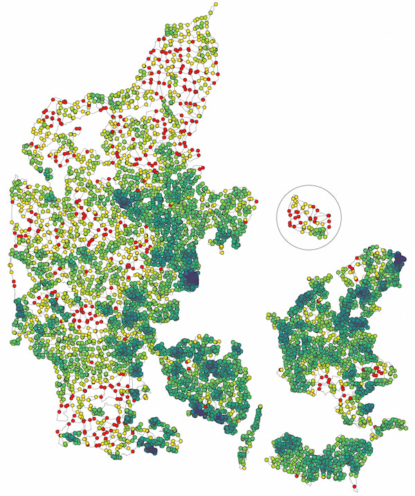

> [!CAUTION]
> This project is under heavy development. Do not use.

# Bicycle node network loop analysis

[](https://github.com/astral-sh/ruff)
[](https://github.com/prettier/prettier)
[](https://github.com/pre-commit/pre-commit)

This is the source code for reproducing the scientific project _Quality assessment of a country-wide bicycle node network with loop census analysis_. The code assesses the quality of a [Bicycle Node Network](https://en.wikipedia.org/wiki/Numbered-node_cycle_network) via loop census analysis.

  
_Output from running the code on Denmark, showing round trip options for a family with small children_

## Installation

To install and use the code, you need to have installed [JupyterLab](https://pypi.org/project/jupyterlab/).

First clone the repository:

```
git clone https://github.com/mszell/bikenwloops
```

Go to the cloned folder.

### Installation with pixi

Installation with [`pixi`](https://pixi.prefix.dev/latest/) is fastest and most stable. Setup a new virtual environment using the `environment.yml` file:

```
pixi init --import environment.yml
```

Now build the environment and run it:

```
pixi run jupyter lab
```

An instance of Jupyter lab is automatically going to open in your browser after the environment is built.

### Installation with mamba/conda

Alternatively, use [`mamba`](https://mamba.readthedocs.io/en/latest/index.html) (or `conda`, which is slower).

<details><summary>Instructions</summary>
 Create a new virtual environment using the `environment.yml` file:

```
mamba env create -f environment.yml
```

Then, install the virtual environment's kernel in Jupyter:

```
mamba activate bikenwloops
ipython kernel install --user --name=bikenwloops
mamba deactivate
```

You can now run Jupyter `jupyter lab` with the kernel `bikenwloops ` (Kernel > Change Kernel > bikenwloops).

</details>

## Data setup

Download the data from zenodo: [insert link]  
Unpack the `data` folder into the folder of the repository. This is the data set to reproduce the paper.

## Running the code

There are several numbered notebooks which need to be run in a certain order and with specific config settings. Here are the instructions to reproduce the paper.

1. In the [config.yml](parameters/config.yml), set `study_area: bornholm`. Run [notebook 00](code/00_network_preprocessing.ipynb). Repeat this step for the other 5 study areas `funen`, `jutland`, `lollandfalster`, `longland`, `zealand`.
1. In the [config.yml](parameters/config.yml), set `study_area: denmark`.
1. Run [notebook 01](code/01_poi_snapping.ipynb).
1. Run [notebook 02](code/02_loop_generation.ipynb).
1. Run [notebook 03](code/03_basic_statistics.ipynb).
1. In the [config.yml](parameters/config.yml), set `scenarioid: 0`. Run [notebook 04](code/04_scenario_analysis.ipynb). Repeat this step for the other 2 scenarioids `1` and `2`.
1. In the [config.yml](parameters/config.yml), set `scenarioid: 0`. Run [notebook 05](code/05_hexgrid_correlations.ipynb). Repeat this step for the other 2 scenarioids `1` and `2`.
1. Run [notebook 06](code/06_preprocessing_stats.ipynb).
1. Run [notebook 07](code/07_synthetic_network_analysis.ipynb).

## Original data retrieval

Data of the knudepunkter network comes from [BikeNodePlanner: Data for Denmark](https://github.com/anastassiavybornova/bike-node-planner-data-denmark) and [BikeNodePlanner](https://github.com/anastassiavybornova/bike-node-planner).

> [!CAUTION]
> All necessary data to reproduce the paper have been assembled in the zenodo repository above, so it is not necessary nor recommended to re-do this data retrieval.

<details><summary>Nevertheless, here we provide our original steps to retrieve and assemble the data.</summary>

### Step 1: Extract data with BikeNodePlanner: Data for Denmark

- Use [BikeNodePlanner: Data for Denmark](https://github.com/anastassiavybornova/bike-node-planner-data-denmark)
- Uncomment the municipalities of your study area in `config-municipalities.yml`. Several config files are already prepared for copy-pasting in the [`parameters/dataretrieval/`](parameters/dataretrieval/) folder for large study areas like Jutland or Zealand.
- Set all values in `config-layers-polygon.yml` to `ignore`. This file is already [prepared](parameters/dataretrieval/config-layers-polygon.yml) for copy-pasting.
- Run the `run.sh` script
- Copy all subfolders of `/input-for-bike-node-planner/` into the `/data/input/` folder of bike-node-planner

### Step 2: Add elevation data with BikeNodePlanner

This step is needed to add elevation data (from `dem/dem.tif`) to the edges, creating an `edges_slope.gpkg` file.

- Use [BikeNodePlanner](https://github.com/anastassiavybornova/bike-node-planner)
- Run scripts 01 to 04
- Let's call `loopspath` the data/input path to your project, for example `bikenwloops/data/input/funen/`
- Copy the file `edges_slope.gpkg` from `bike-node-planner/data/output/elevation` into `loopspath/network/processed/`
</details>

## Repository structure

```
├── code                    <- Jupyter notebooks and py scripts
├── data                    <- Data (not saved on github)
│   ├── input               <- Original, immutable data
│   └── processed           <- Modified data
├── parameters              <- Parameters and config files
│   └── dataretrieval       <- Config files for retrieving data
├── plots                   <- Generated figures
├── .gitignore              <- Files and folders ignored by git
├── .pre-commit-config.yaml <- Pre-commit hooks used
├── LICENSE.txt
├── README.md
└── environment.yml         <- Environment file to set up the environment using pixi
```
