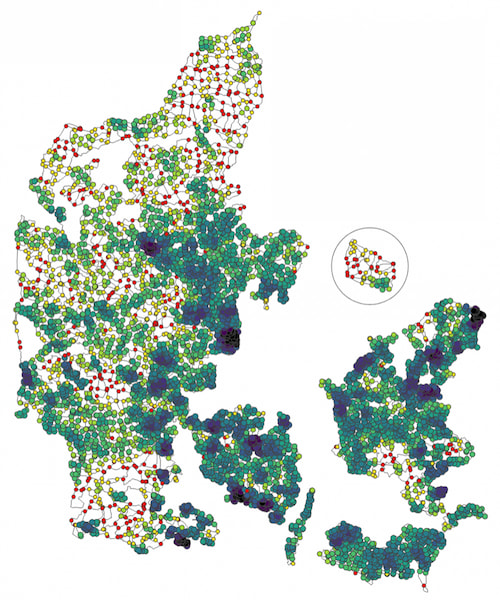

> [!CAUTION]
> This project is under heavy development. Do not use.

# Bicycle node network loop analysis

[](https://github.com/astral-sh/ruff)
[](https://github.com/prettier/prettier)
[](https://github.com/pre-commit/pre-commit)

This is the source code for the scientific project _Quality assessment of a country-wide bicycle node network with loop census analysis_. The code assesses the quality of a [Bicycle Node Network](https://en.wikipedia.org/wiki/Numbered-node_cycle_network) via loop census analysis.
  
_Output from running the code on Denmark, showing round trip options for a family with small children_

## Installation

First clone the repository:

```
git clone https://github.com/mszell/bikenwloops
```

Go to the cloned folder and create a new virtual environment via `mamba` using the `environment.yml` file:

```
mamba env create -f environment.yml
```

Then, install the virtual environment's kernel in Jupyter:

```
mamba activate bikenwloops
ipython kernel install --user --name=bikenwloops
mamba deactivate
```

You can now run `jupyter lab -kernel bikenwloops`.

## Data setup

Data of the knudepunkter network comes from [BikeNodePlanner: Data for Denmark](https://github.com/anastassiavybornova/bike-node-planner-data-denmark) and [BikeNodePlanner](https://github.com/anastassiavybornova/bike-node-planner).

### Step 1: Extract data with BikeNodePlanner: Data for Denmark

- Use [BikeNodePlanner: Data for Denmark](https://github.com/anastassiavybornova/bike-node-planner-data-denmark)
- Uncomment the municipalities of your study area in `config-municipalities.yml`. Several config files are already prepared for copy-pasting in the [`parameters/dataretrieval/`](parameters/dataretrieval/) folder for large study areas like Jutland or Zealand.
- Set all values in `config-layers-polygon.yml` to `ignore`. This file is already [prepared](parameters/dataretrieval/config-layers-polygon.yml) for copy-pasting.
- Run the `run.sh` script
- Copy all subfolders of `/input-for-bike-node-planner/` into the `/data/input/` folder of bike-node-planner

### Step 2: Add elevation data with BikeNodePlanner

This step is needed to add elevation data (from `dem/dem.tif`) to the edges, creating an `edges_slope.gpkg` file.

- Use [BikeNodePlanner](https://github.com/anastassiavybornova/bike-node-planner)
- Run scripts 01 to 04
- Let's call `loopspath` the data/input path to your project, for example `bikenwloops/data/input/funen/`
- Copy the file `edges_slope.gpkg` from `bike-node-planner/data/output/elevation` into `loopspath/network/processed/`

## Repository structure

```
├── code                    <- Jupyter notebooks and py scripts
├── data                    <- Data (not saved on github)
│   ├── input               <- Original, immutable data
│   └── processed           <- Modified data
├── parameters              <- Parameters and config files
│   └── dataretrieval       <- Config files for retrieving data
├── plots                   <- Generated figures
├── .gitignore              <- Files and folders ignored by git
├── .pre-commit-config.yaml <- Pre-commit hooks used
├── LICENSE.txt
├── README.md
└── environment.yml         <- Environment file to set up the environment using conda/mamba
```
